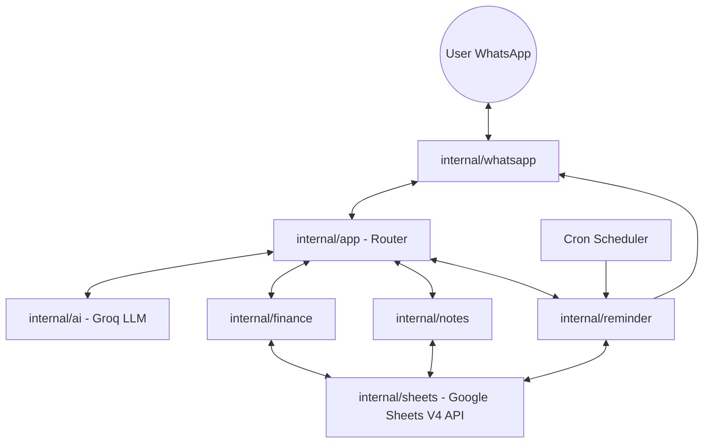

# 🤖 Intelijen Keuangan: WhatsApp AI Financial Assistant

**Intelijen Keuangan** adalah asisten finansial cerdas berbasis AI yang beroperasi langsung di dalam WhatsApp. Bot ini bertindak sebagai akuntan pribadi yang mencatat transaksi, menganalisis arus kas, mengelola catatan, dan memberikan pengingat terjadwal—semuanya dikelola secara otomatis di **Google Sheets** dengan format visual yang profesional dan "paten".

---

## 🌟 Fitur Utama

### 1. 🧠 Pelacakan Keuangan Berbasis AI (Natural Language)
Bot ini memahami bahasa manusia sehari-hari (didukung oleh **Groq LLM**). Tidak perlu perintah kaku:
- *"Barusan makan siang sate 50rb"* -> Otomatis tercatat sebagai **Pengeluaran**, kategori **Makanan**, tanggal hari ini.
- *"Gajian masuk 10jt"* -> Tercatat sebagai **Pemasukan**.
- *"Tolong hitung pengeluaran gw seminggu terakhir"* -> Bot akan menganalisis data di Sheets dan memberikan ringkasan.

### 2. 📊 Smart Dashboard & Patent Layout (Google Sheets)
Sistem ini menggunakan Google Sheets bukan sekadar database, tapi sebagai dashboard visual yang matang:
- **Dashboard Pixel-Perfect**: Layout dashboard yang rapi dengan 5 chart interaktif (Tren Pemasukan, Saldo, Distribusi Kategori, dll).
- **Format Paten**: Inisialisasi otomatis dengan margin presisi, tanpa garis tengah (clean look), alignment profesional, dan zebra banding otomatis.
- **Auto-Month Setup**: Setiap bulan baru, bot otomatis menyiapkan tab transaksi baru dengan format yang konsisten.

### 3. 📅 Sistem Proaktif & Motivasi (Engagement)
Bot tidak hanya menunggu perintah, tapi juga proaktif:
- **07:00 WIB - Motivasi Pagi**: Sapaan hangat dan kutipan motivasi segar setiap pagi (AI-generated).
- **17:00 WIB - Reminder Sore**: Pengingat ramah untuk mencatat transaksi hari ini.
- **21:00 WIB - Laporan Malam**: Ringkasan pengeluaran/pemasukan hari ini + Progress bulanan berjalan.

### 4. ⏰ Reminder & Task Management
- Jadwalkan pengingat: *"Ingetin bayar kosan tanggal 25 jam 10 pagi"*.
- Mode **Until Done**: Pengingat akan dikirim 3x sehari sampai Anda menandainya sebagai `/done`.
- Integrasi chat: Balas dengan *"Udah beres"* untuk menandai tugas selesai secara otomatis.

---

## 🏗️ Arsitektur Proyek

Proyek ini dibangun dengan prinsip **Clean Architecture** menggunakan bahasa **Go**:



### Detail Layer:
- **`cmd/bot/`**: Entry point aplikasi, inisialisasi layanan, dan manajemen graceful shutdown.
- **`internal/whatsapp/`**: Integrasi dengan `whatsmeow`. Menangani QR Auth, manajemen sesi, dan routing pesan (DM/Group).
- **`internal/app/`**: Otak utama yang memproses pesan, mendeteksi intent (Command vs AI), dan mengelola alur percakapan.
- **`internal/sheets/`**: Layer DAO (Database Access Object) yang sangat kompleks untuk manipulasi Google Sheets (Formatting, Merging, Charting, Data Entry).
- **`internal/reminder/`**: Layanan penjadwalan untuk pings pengingat dan laporan otomatis.

---

## 🛠️ Persiapan & Instalasi

### 1. Kebutuhan Sistem
- **Go 1.20+**
- **Google Cloud Service Account** (dengan akses ke Google Sheets API).
- **Groq API Key** (untuk pemrosesan bahasa alami).
- **Akun WhatsApp** untuk di-scan sebagai bot.

### 2. Konfigurasi Environment
Buat file `.env` di root direktori:

```env
# --- LLM Configuration (Groq) ---
LLM_API_KEY=gsk_your_key_here
LLM_BASE_URL=https://api.groq.com/openai/v1
LLM_MODEL=llama-3.3-70b-versatile

# --- Google Sheets ---
GOOGLE_APPLICATION_CREDENTIALS=./data/google/service-account.json
SHEETS_SPREADSHEET_ID=your_spreadsheet_id_here

# --- WhatsApp ---
WHATSAPP_SESSION_DB_PATH=./data/whatsapp/session.db
OWNER_IDS=6281234567890,85xxxxxxxxxxxx

# --- Group Support (Optional) ---
ALLOWED_GROUP_JIDS=120363xxxxxxxx@g.us
```

### 3. Cara Menjalankan
```bash
# Build aplikasi
go build -o bot ./cmd/bot

# Jalankan
./bot
```
Scan QR code yang muncul di terminal menggunakan aplikasi WhatsApp Anda *(Linked Devices)*.

---

## 📋 Daftar Perintah (Commands)

Selain bahasa alami, bot juga mendukung perintah manual:
- `/menu` - Menampilkan menu fitur utama.
- `/laporan` - Melihat ringkasan keuangan bulan ini.
- `/budget` - Cek status budget kategori.
- `/kategori` - Lihat daftar kategori yang tersedia.
- `/export` - Mendapatkan link langsung ke Google Sheets.
- `/reminder` - List pengingat yang aktif.
- `/done [ID]` - Menandai pengingat selesai.
- `/hapus` - Menghapus transaksi terakhir (Undo).

---

**Built with Go, Whatsmeow, and ❤️ for Financial Freedom.**
